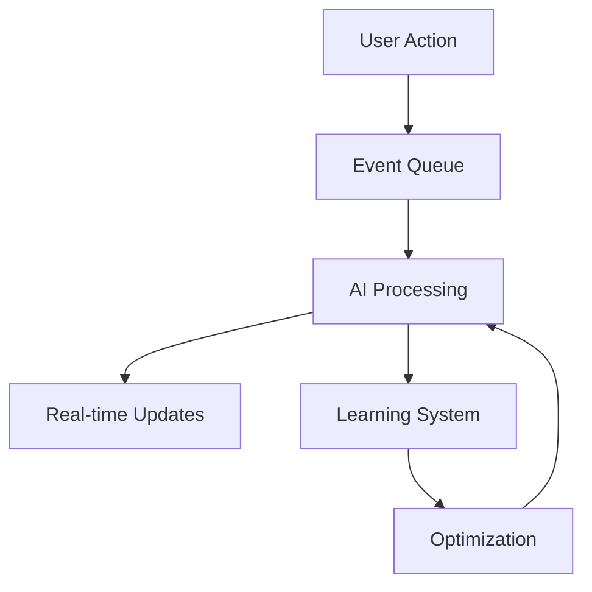

# 8thDegree Implementation Plan

## Phase 1: Core Infrastructure Setup

### 1.1 Database Migration and Setup
1. **Schema Setup**
   ```sql
   CREATE SCHEMA auth;
   CREATE SCHEMA core;
   CREATE SCHEMA ai;
   ```

2. **Sharding Implementation**
   - Geographic Sharding
     - Primary regions: NA, EU, ASIA, SA
     - Shard key design: `region_user_id`
   - Vertical Sharding
     - User data
     - Job data
     - Messages
     - Analytics

3. **Migration Strategy**
   - Create migration scripts
   - Data validation procedures
   - Rollback procedures
   - Monitoring queries

### 1.2 Authentication Enhancement
1. **OAuth Implementation**
   - Google OAuth
   - GitHub OAuth
   - Enterprise SSO connectors
   - Session management

2. **RBAC Setup**
   ```python
   Roles = {
     'user_freelancer',
     'user_client',
     'admin',
     'superadmin'
   }
   ```

3. **2FA Implementation**
   - TOTP setup
   - Recovery codes
   - Backup methods

### 1.3 Development Environment
1. **Docker Configuration**
   ```yaml
   services:
     - app
     - frontend
     - ai-service
     - postgres
     - redis
     - elasticsearch
     - monitoring
   ```

2. **Testing Environment**
   - Cypress setup
   - Jest configuration
   - Pytest setup
   - Load testing tools

## Phase 2: AI Service Implementation

### 2.1 Core AI Services
1. **Embedding Service**
   ```python
   class EmbeddingService:
       def __init__(self, model: str = "text-embedding-3-small"):
           self.model = model
           self.openai = OpenAI()
       
       async def generate_embedding(self, text: str) -> List[float]:
           response = await self.openai.embeddings.create(
               model=self.model,
               input=text
           )
           return response.data[0].embedding
   ```

2. **Matching Engine**
   ```python
   class MatchingEngine:
       def __init__(self, embedding_service: EmbeddingService):
           self.embedding_service = embedding_service
       
       async def find_matches(
           self,
           job_description: str,
           candidate_pool: List[Dict],
           threshold: float = 0.7
       ) -> List[Dict]:
           job_embedding = await self.embedding_service.generate_embedding(job_description)
           matches = []
           for candidate in candidate_pool:
               similarity = self.calculate_similarity(job_embedding, candidate['embedding'])
               if similarity >= threshold:
                   matches.append({**candidate, 'score': similarity})
           return sorted(matches, key=lambda x: x['score'], reverse=True)
   ```

3. **Bias Detection**
   ```python
   class BiasDetector:
       def __init__(self):
           self.bias_patterns = self.load_bias_patterns()
       
       async def analyze_text(self, text: str) -> Dict[str, Any]:
           embeddings = await self.embedding_service.generate_embedding(text)
           return {
               'bias_score': self.calculate_bias_score(embeddings),
               'recommendations': self.generate_recommendations(embeddings)
           }
   ```

### 2.2 Real-time Processing
1. **Event Processing**
   ```python
   class EventProcessor:
       def __init__(self, redis_client: Redis):
           self.redis = redis_client
           self.matching_engine = MatchingEngine()
       
       async def process_event(self, event: Dict[str, Any]):
           if event['type'] == 'new_job':
               await self.process_new_job(event['data'])
           elif event['type'] == 'user_update':
               await self.update_user_matches(event['data'])
   ```

2. **WebSocket Integration**
   ```python
   class MatchingWebSocket:
       async def on_connect(self, websocket: WebSocket):
           await websocket.accept()
           await self.subscribe_to_matches(websocket)
       
       async def broadcast_matches(self, matches: List[Dict]):
           for client in self.active_connections:
               await client.send_json(matches)
   ```

### 2.3 Learning System
1. **Success Tracking**
   ```python
   class SuccessTracker:
       def __init__(self):
           self.metrics = MetricsCollector()
       
       async def track_match_outcome(
           self,
           job_id: str,
           candidate_id: str,
           outcome: str
       ):
           await self.metrics.record_outcome(job_id, candidate_id, outcome)
           await self.update_matching_weights(outcome)
   ```

2. **Optimization Engine**
   ```python
   class OptimizationEngine:
       def __init__(self):
           self.success_tracker = SuccessTracker()
       
       async def optimize_weights(self):
           metrics = await self.success_tracker.get_metrics()
           return self.calculate_optimal_weights(metrics)
   ```

## Phase 3: Monitoring Setup

### 3.1 Metrics Collection
1. **Core Metrics**
   - Performance metrics
   - Business metrics
   - User engagement
   - Error tracking

2. **Custom Dashboards**
   - User dashboard
   - Admin dashboard
   - System dashboard
   - Analytics dashboard

### 3.2 Alerting System
1. **Alert Rules**
   - Performance thresholds
   - Error rates
   - Business metrics
   - Security alerts

## Implementation Timeline

### Week 1: AI Foundation (Current)
- [x] Basic sharding implementation
- [ ] Embedding service setup
- [ ] Initial matching engine
- [ ] Real-time processing foundation

### Week 2: Core Features
- [ ] Complete matching engine
- [ ] Bias detection system
- [ ] WebSocket integration
- [ ] Event processing system

### Week 3: Learning System
- [ ] Success tracking
- [ ] Optimization engine
- [ ] Metrics collection
- [ ] Weight optimization

### Week 4: Model and Service Layer
- [ ] Complete sharded models
- [ ] Shard-aware services
- [ ] Cross-shard operations
- [ ] Metrics collection
- [ ] CLI tools for shard management

### Week 5-6: Authentication & Security
- [ ] OAuth implementation
- [ ] RBAC setup
- [ ] 2FA integration

### Week 7-8: AI/ML Service
- [ ] Microservice setup
- [ ] Basic matching algorithm
- [ ] Feed customization

### Week 9-10: Monitoring & Testing
- [ ] Metrics collection
- [ ] Dashboard setup
- [ ] Alert system

## Deployment Strategy

### Development
- Local Docker environment
- Development database
- Mock services

### Staging
- AWS staging environment
- Staging database
- Limited AI features

### Production
- Full AWS deployment
- Production database cluster
- Complete AI integration

## Testing Strategy

### Unit Testing
- Frontend: Jest
- Backend: Pytest
- Coverage target: 80%

### Integration Testing
- API testing
- Service integration
- Database operations

### E2E Testing
- Cypress test suites
- User flow testing
- Performance testing

## Monitoring Strategy

### Development
- Local monitoring stack
- Debug logging
- Performance profiling

### Production
- AWS CloudWatch
- Custom metrics
- Business analytics

## Backup Strategy

### Database
- Daily full backups
- Hourly incrementals
- Point-in-time recovery

### Application
- Configuration backups
- User data exports
- System state snapshots

## Security Measures

### Data Protection
- Encryption at rest
- Encryption in transit
- Data anonymization

### Access Control
- RBAC enforcement
- API security
- Rate limiting

## Maintenance Procedures

### Regular Tasks
- Log rotation
- Cache clearing
- Index optimization

### Emergency Procedures
- Rollback procedures
- Incident response
- Data recovery

## Current Progress (March 8, 2024)
1. Completed:
   - Initial schema migration
   - Database session management
   - Base model with sharding support
   - User and OAuth models with sharding
   - Sharding infrastructure
   - Testing infrastructure for shards
   - CI/CD configuration

2. In Progress:
   - Remaining sharded models implementation
   - Shard management tools
   - Development environment setup

3. Next Up:
   - Job and Review models with sharding
   - AI/ML models with sharding
   - Shard management CLI
   - Service layer implementation

## Implementation Priorities
1. Model Layer
   - Complete Job model with sharding
   - Complete Review model with sharding
   - Implement AI/ML models with sharding
   - Add cross-shard relationship handling

2. Management Layer
   - Shard initialization CLI
   - Shard monitoring tools
   - Metrics collection
   - Health checks

3. Service Layer
   - Shard-aware services
   - Cross-shard operations
   - Query optimization
   - Caching strategy

4. Development Environment
   - Multi-shard local setup
   - Development tools
   - Monitoring dashboard
   - Test data generation

## AI Integration Strategy

### Data Flow


### Monitoring Strategy
1. AI Metrics
   - Embedding generation time
   - Match accuracy
   - Bias detection rate
   - Learning system performance

2. Real-time Metrics
   - Event processing latency
   - WebSocket performance
   - Cache hit rates
   - Cross-region latency

### Scaling Considerations
1. AI Services
   - Horizontal scaling of embedding services
   - Distributed matching engine
   - Regional optimization nodes

2. Real-time Processing
   - Event queue scaling
   - WebSocket clustering
   - Cache distribution

## Updated Focus
- AI integration details
- Real-time processing
- Learning system
- AI metrics
- Scaling considerations 