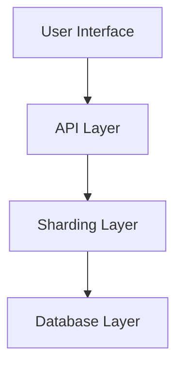
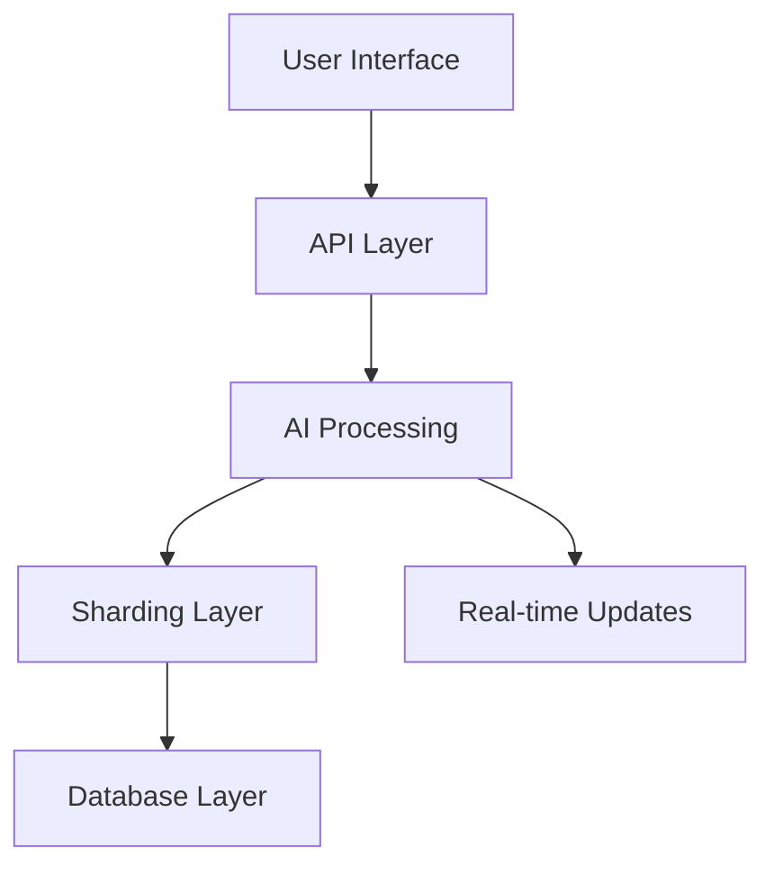

# 8thDegree Vision Alignment

## Project Vision
8thDegree is an AI-powered freelancing platform that prioritizes fair matching and real-time connections between clients and freelancers.

## Core Value Propositions
1. AI-Driven Matching
2. Fair and Unbiased Platform
3. Global Scale with Local Relevance
4. Real-time Engagement

## Current Implementation vs Vision

### AI Features (Primary Focus)
- [x] Base infrastructure for AI integration
- [x] Real-time matching engine
- [x] Bias detection system
- [ ] Personalized feeds
- [ ] Smart search implementation

### Infrastructure (Supporting Focus)
- [x] Database sharding foundation
- [x] Cross-region query support
- [x] Relationship management
- [x] Performance optimization
- [x] Caching layer
- [x] Rate limiting
- [x] Circuit breakers
- [x] Model registry

### Security & Compliance
- [x] API key authentication
- [x] Rate limiting
- [x] Input validation
- [x] Output filtering
- [x] Security policies
- [x] Privacy policies
- [x] Documentation

### User Experience (End Goal)
- [x] Real-time updates
- [x] Instant matching
- [ ] Regional relevance
- [ ] Fair opportunity distribution

## Architecture Alignment

### Current Architecture

### Target Architecture

## Implementation Priority Realignment

### Phase 1: Core AI Infrastructure
1. AI Service Foundation
   - Embedding generation
   - Matching algorithms
   - Bias detection

2. Data Management
   - Sharded data access
   - Cross-region optimization
   - Real-time updates

### Phase 2: User-Facing Features
1. Search and Discovery
   - AI-powered search
   - Smart filters
   - Regional relevance

2. Matching System
   - Real-time recommendations
   - Fair matching algorithms
   - Cross-region opportunities

### Phase 3: Platform Intelligence
1. Learning System
   - User behavior analysis
   - Success rate tracking
   - Bias monitoring

2. Optimization Engine
   - Match quality improvement
   - Performance optimization
   - Regional adaptation

## Technical Debt Considerations
1. Current:
   - Heavy focus on sharding infrastructure
   - Complex cross-region queries
   - Relationship management overhead

2. Mitigation:
   - Simplify sharding where possible
   - Focus on AI feature support
   - Prioritize user experience

## Next Steps Realignment

### Immediate Actions
1. Complete testing infrastructure
2. Set up monitoring dashboards
3. Create deployment guides
4. Enhance documentation

### Short-term Goals
1. Integration testing
2. Performance optimization
3. Production readiness
4. Security hardening

### Medium-term Goals
1. Enhanced AI features
2. Regional optimization
3. User experience improvements
4. Business metrics

## Success Metrics
1. Technical Metrics
   - Query response times
   - Match accuracy
   - System scalability
   - Real-time performance

2. Business Metrics
   - Match success rate
   - User satisfaction
   - Platform fairness
   - Regional engagement

## Documentation Updates Needed
1. README.md
   - Update architecture diagram
   - Clarify AI focus
   - Add scaling information

2. Implementation Plan
   - Reorder priorities
   - Add AI milestones
   - Update timelines

3. API Documentation
   - Add AI endpoints
   - Document scaling considerations
   - Update authentication flows 